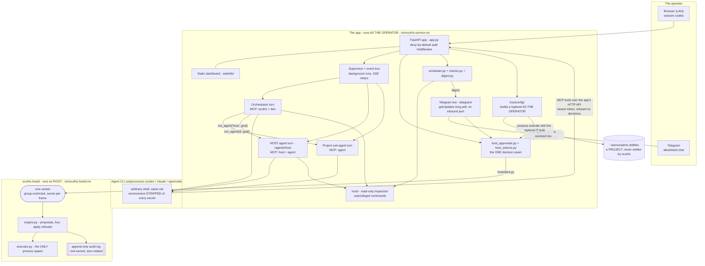
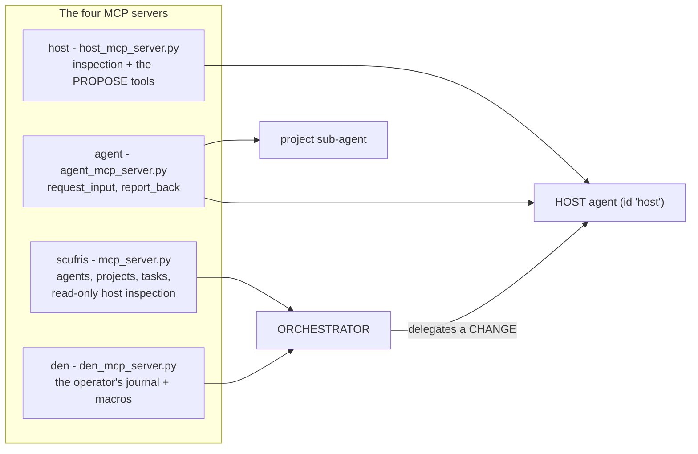

# `scufris/` - the architecture

How the application is put together: what runs in which process, who is trusted
with what, and where a request travels. Setup lives in the
[root README](../README.md); the rules for changing this code live in
[`AGENTS.md`](../AGENTS.md); the reasoning behind each fork lives in the
`DECISION.md` files under [`tasks/`](../tasks/). This file is the layer between
them.

## 1. One process, three privilege levels

The app is a single FastAPI/Uvicorn process that runs as the operator. It spawns
agent CLI subprocesses (which run arbitrary shell as that same user), and it
talks to a **separate root process** over a unix socket. Nothing else is
privileged.



The boundaries that matter, and what enforces each:

| Boundary | Enforced by | Why it is there |
|---|---|---|
| Browser -> app | one deny-by-default HTTP middleware, `api/auth.py::auth_middleware`, plus a tiny public allowlist (`auth.PUBLIC_PATHS`, `PUBLIC_STATIC_PATHS`) | a new route is protected because it was added, not because someone remembered a decorator. `tests/test_auth_boundary.py` sweeps `iter_routes(app)` to prove it |
| Telegram -> operator identity | the chat-id allowlist, re-checked in `telegram/wiring.py::build_approval_ops` | the bot is in-process and polls outward, so there is no inbound port and no webhook. The allowlist IS the credential, and the transport never supplies an actor string of its own |
| agent subprocess -> app | a per-process bearer token minted in `create_app` (`Settings.auth_api_token`) | the app calls its own API from MCP tool subprocesses. Loopback is not an identity |
| agent subprocess -> decisions | `auth.OPERATOR_ONLY_PATTERN` | a machine token may never approve, deny, revert, cancel, or run the checks on demand. Approving is an operator act and needs a session, whatever the bind address |
| app -> root | unix socket plus `SCUFRIS_HOSTD_SECRET`, authenticated per frame | no sudo rules exist. The app cannot run a privileged command, only ask for a verb |
| agent CLI -> root socket | `config.SECRET_ENV_VARS`, stripped in `agent.agent_subprocess_env` | the secret arrives via an `EnvironmentFile`, so it IS in `os.environ`. Without stripping, every shell command the model runs would hold the credential for the root socket |
| root -> the record | `scufris_hostd`'s `audit.py`: only an append path exists | the audit has to stay trustworthy when the app is the thing that misbehaved |

Two secrets belong in the sops dotenv the unit reads as an `EnvironmentFile`:
`SCUFRIS_AUTH_PASSWORD_HASH` and `SCUFRIS_HOSTD_SECRET`. `create_app` refuses to
build an app that has the hostd secret and no password hash - host agency with
nobody to approve is not a deployment.

## 2. Reading the host

`scufris_host` (`packages/host/`) is read-only, needs no privilege, and is its
own distribution depending on no sibling. Every command goes through one
`Runner` seam, every report carries an `Availability`, and every read is bounded.
That is the whole package's contract, and it is what makes "I could not read
this" a different answer from "there is nothing here". Details in
[`packages/host/src/scufris_host/README.md`](../packages/host/src/scufris_host/README.md).

Two consumers: the dashboard (`/api/host/overview`, cached because it shells out)
and the inspection MCP tools, which BOTH the orchestrator and the host agent
hold.

## 3. Changing the host: one contract

Every mutating path obeys this, with no exceptions:

```
propose -> preview -> approve -> apply -> audit -> roll back
```

```
   HOST AGENT                APP                     HOSTD (root)          OPERATOR
   ==========                ===                     ============          ========

  propose_host_action  -->  POST /api/host/actions
   (a VERB + typed args)      |
                             |  requester from the CREDENTIAL,
                             |  never from the request body
                             +--------------------------->  build_plan(verb, args)
                                                            ActionRefused if not
                                                            a verb it implements
                                                              |
                                                            build_preview()
                                                            + Reversal + Fingerprint
                                                              |
                             <-------- ProposalView (id) -----+  state: PENDING
                             |                                   (10 minute window)
   agent goes BLOCKED  <-----+
   (operator-bound: the      |
    orchestrator may not     +-- render_action() --> dashboard /host/  ---> reads
    answer it)               |          ONE renderer  Telegram message  ---> decides
                             |                                                 |
                             |  <----- approve(id, actor) / deny(id, reason) --+
                             |         actor derived from the surface's
                             |         own credential
                             +--------------------------->  apply(id)
                                                            refuses: not_found,
                                                            already_used, expired,
                                                            drifted
                                                              |
                                                            Executor: step 1..n
                                                            in its own process group
                                                              |
                                                            append AuditRecord
                             <------ ResultFrame -------------+  state: APPLIED
                             |       steps_completed/total       or FAILED
   agent RESUMED <-----------+
   with the applied result
   or the denial reason      +--> revert: the applied record offers exactly
                                  the recorded reversal, as a NEW proposal
                                  with its own preview and approval
```

Properties this shape gives, rather than checks that try to:

- **A caller names a verb, never a command.** No request has an argv field, and
  `ActionKind` is a closed enum, so an unknown verb fails to parse at the socket.
  The helper builds every argv itself.
- **Preview one thing, apply another has no code path.** The proposal registry
  lives in the privileged process; a caller can only name an id the helper
  issued, and the approved argv is the only argv there is.
- **A proposal is used once.** Every state but `PENDING` is terminal, and
  `APPLYING` is the atomic claim, so two approvals racing on one id produce one
  execution and one refusal.
- **Drift is terminal, not a warning.** A preview describing a system that has
  moved is `DRIFTED`: re-propose and read a fresh preview.
- **A half-applied plan says so.** `steps_completed < steps_total` is a real
  recorded state, which for a configuration change means this boot and the next
  boot disagree.

Two surfaces decide, and there is exactly one set of rules:
`host_approvals.HostApprovalService` owns approve / deny / cancel / revert and
the `decidable()` predicate, both surfaces render from
`host_actions.render_action`, and the actor string is derived from the
credential - a session id for the dashboard, `operator:telegram:<chat_id>` for
the chat. The difference between the two surfaces is that one string.

An action that cannot be undone has no ordinary approve control at all:
`host_actions.confirmation_for` demands a typed acknowledgement, and the server
enforces the same rule the UI shows.

The verbs, their arguments, the refusals and the wire format are in
[`packages/hostd/src/scufris_hostd/README.md`](../packages/hostd/src/scufris_hostd/README.md).

## 4. Agents

A run is never done inside a request. `supervisor.py` executes it in the
background, `eventbus.py` fans its events out to SSE subscribers with a bounded
replay buffer, and the HTTP layer only starts runs and reads streams. That is
what makes a turn survivable: a browser can reconnect mid-run, and the Telegram
bot watches the same events.

Starting and finishing a turn belongs to `orchestrator/`, not to whichever
transport asked. The landing chat, the Telegram bot and the wake bridge all
reach `AgentRunService.launch`, so "is the orchestrator busy" has ONE answer
rather than three that drifted apart.

- **The orchestrator** is the landing chat. It delegates rather than doing
  everything itself: `run_agent(id, goal)` for a project, `run_agent("host",
  goal)` for a machine change.
- **Project agents** are records in `agent_store/`, bound to a project from
  `projects.py`, each with its own backend, model, permission mode and resumable
  session.
- **The host agent** (`enums.HOST_AGENT_ID`) is reserved, bound to the MACHINE
  rather than a project, read-only on files by construction, and the only
  audience holding the propose tools.

Agents talk **both ways**. A sub-agent that hits a decision it cannot make
safely calls `request_input` and finishes `waiting`; the orchestrator either
polls (`pending_agents`) or is woken by `wake.py` when `SCUFRIS_AUTO_WAKE` is on,
then answers by resuming that session. `report_back` closes the loop the other
way.

A host approval travels the same road with one deliberate difference:

- **`waiting` means the orchestrator owes an answer. `blocked` means the
  OPERATOR does.** A blocked agent shows up in `pending_agents`, and the chat
  route refuses an agent-credential message to it - "approved, go ahead" is not
  the orchestrator's to say.
- Liveness is asked as `live_for_agent` (undecided, still PENDING with the
  helper, inside its window), not as "is the agent blocked": keying it on the
  state alone left an agent permanently unreachable when nobody ever answered.

Any in-flight turn can be cancelled, from the chat's stop button or the
orchestrator's `cancel_agent` tool; the partial answer is kept and tagged.

## 5. Which agent holds which tools

The audience split is PHYSICAL. A tool reaches an audience by being registered on
a server that audience's turn wires up - not by a filter at call time.
`enums.audience_for` decides; `agent.scufris_mcp_servers` wires it.



`mcp_host_tools.register(mcp, actions=...)` defines the host toolset once:
`mcp_server.py` registers it with `actions=False`, `host_mcp_server.py` with
`actions=True`. So the orchestrator can answer "why is this box hot" directly,
while changing anything is a delegation - and a project sub-agent has no host
server at all.

There is deliberately **no approve tool**, for any audience.
`tests/test_host_mcp_server.py::test_the_agent_has_no_tool_that_approves_a_host_action`
asserts its absence by walking the registered tool names. The
propose/preview/approve contract is stated in exactly one steering preamble,
`sessions.HOST_STEERING_PREAMBLE`.

`SCUFRIS_DISABLED_TOOLS` drops tools inside the MCP server process at startup, so
a disabled tool genuinely cannot be called.

## 6. Authentication

`auth/` (the primitives) plus one middleware, `api/auth.py::auth_middleware`,
which is also where the session gate and the `/api/auth/*` routes live - see
section 7 for the router boundary:

- The **bind address decides the posture** (`SCUFRIS_AUTH_MODE=auto`): open on
  loopback so `pytest`, the examples and the mock backend need no credentials;
  mandatory on anything network-reachable, where the server refuses to START
  without a password hash rather than warning and serving.
- Sessions are opaque ids in `HttpOnly`, `SameSite=Lax` cookies backed by
  revocable server-side records under `SCUFRIS_STATE_DIR`. State-changing
  requests also need a CSRF token and a same-origin `Origin`/`Referer`.
- The **machine token** is minted per process and kept out of `os.environ`
  entirely, so it reaches only the MCP servers that call the API - an env var
  would be inherited by every shell command the model runs.
- `OPERATOR_ONLY_PATTERN` refuses that token on the decision endpoints and on
  `/api/host/digests/run`, whatever the bind address.
- The posture itself is not runtime-mutable: it must not be changeable through
  the surface it protects.

## 7. The HTTP surface

### Where a route lives - `api/`

`create_app` assembles routers; it no longer holds routes. One module per domain
under `api/`, each exporting a `build_*_router` factory that takes its
dependencies EXPLICITLY - a frozen deps dataclass or plain arguments - and
returns an `APIRouter`. Nothing in `api/` constructs a store, opens a database or
reads the environment: `create_app` owns the object graph, and a router is handed
the pieces it needs.

| Module | Serves | Depends on |
|---|---|---|
| `api/auth.py` | `/api/auth/login\|logout\|session`, plus `SessionGate` and the enforcement middleware | `SessionGate`, `LoginThrottle` |
| `api/host.py` | `/api/stats`, `/api/processes`, `/api/host/overview`, `/api/host/actions...`, `/api/host/digests...`, `/api/host/audit`, `/api/config` | `HostDeps`: the gate, the collectors, the overview cache, `HostdClient`, `HostActionStore`, `HostApprovalService`, the apply supervisor, `HostScheduler`, `DigestStore` |
| `api/hostconfig.py` | `/api/host/config/changes...` | `HostConfigDeps`: the gate and `ConfigChangeService` |
| `api/projects.py` | `/api/projects...` and the `/projects/{id}` SPA shells | `ProjectDeps`: `ProjectStore`, `Settings` |
| `api/agents.py` | the agent RECORDS - `/api/agents` (list, create), `/backends`, `/pending`, `/api/agents/{id}` (get, patch, delete), `/capabilities`, and the `/agents/{id}` SPA shells | `AgentDeps`: `AgentStore`, `SettingsStore`, `AgentRunService`, `Settings` |
| `api/agent_runs.py` | RUNNING an agent - the rest of `/api/agents/{id}/*`: run, cancel, status, events, chat, the sub-agent signals, fork, transcript and the diagnostics. Exports the `require_agent*` translators `api/agents.py` reuses | `AgentRunDeps`: `AgentRunService`, `AgentDiagnostics`, `SessionGate`, `AgentStore`, `HostApprovalService`, the supervisor, `Settings` |
| `api/legacy_agent.py` | `/api/agent/*` - the orchestrator-scoped singular surface kept for the console | `LegacyAgentDeps`: `AgentStore`, `SettingsStore`, `AgentDiagnostics`, `AgentRunService`, the supervisor, `Settings`, the machine token |
| `api/chat.py` | `/api/chat`, `/api/chat/stream`, `/api/chat/reset` | `ChatDeps`: `OrchestratorTurnService`, `Settings` |
| `api/errors.py` | - | the hostd refusal-to-status table, shared |
| `api/sse.py` | - | the event-bus relay, shared with the agent routes |
| `api/routes.py` | - | `iter_routes`, the ONE way to walk the real route surface |
| `api/openapi.py` | - | the description, the tag list, and `apply_route_tags(app)` - run LAST, after every include |
| `api/request_log.py` | - | the request-id + `method path -> status in Nms` middleware. Here rather than in `scufris_core.logsetup`, which the MCP servers and agent subprocesses import and which carries no web stack |
| `api/static.py` | `/` | `mount_web_dist` and `NoCacheStaticFiles` - the built bundle, mounted last because the mount matches everything |

Two rules hold the boundary, and the tests that prove them are named:

- **a route translates, it does not decide.** What may be proposed
  (`HostApprovalService.propose` refuses `activate`), what a schedule is
  (`HostScheduler.start_now`), whether a second build of a repository is allowed
  (`ConfigChangeService.start`) - all domain rules, all in the service. So is
  the turn path: whether the orchestrator may run at all and what a second
  concurrent turn means (`OrchestratorTurnService`), and the whole run lifecycle
  from the launch claim to the completion fan-out (`AgentRunService`). The
  router turns the refusal into a status and nothing else
  (`tests/test_domain_routers.py::test_host_routes_delegate_to_domain_services`,
  `tests/test_orchestrator_service.py::test_agent_run_lifecycle_is_owned_by_the_run_service`);
- **a router reaches for nothing.** No `Settings()`, no `state_database`, no
  store construction - which is what lets every route be driven on a bare
  `FastAPI()` over fakes
  (`tests/test_domain_routers.py::test_domain_router_dependency_isolation`,
  `tests/test_orchestrator_routers.py::test_orchestrator_routers_reach_for_nothing`).

A router factory binds its dependencies at CONSTRUCTION, so everything a
`build_*_router` call names must already exist at the `include_router` line. That
is deliberate: the routes previously read `scheduler` and `digests` out of
`create_app`'s scope from a thousand lines above where they were built, and only
worked because no request arrived before the factory returned. A missing
dependency is now a construction error rather than a `NameError` on a live
request. Why a deps dataclass and not FastAPI `Depends`: task
`20260801-100425` DECISION.md 1.

`app.py` holds no route at all. `create_app` is settings and collector defaults,
the object graph, the lifespan, the two middlewares, the `include_router` calls,
the static mount and the tag pass; `test_application_factory_assembles_domain_routers`
in `tests/test_route_contract.py` asserts that `app.router.routes` carries no
`APIRoute` of its own. The route-table pin alone cannot see that - it walks
THROUGH included routers, so a route left on the app serves the same path and
reads identically.

The singular `/api/agent/*` family and the scoped `/api/agents/{id}/*` family are
handed the SAME `AgentRunService` and `AgentDiagnostics` instances, so the older
surface has no second reader behind it
(`test_legacy_agent_routes_delegate_to_scoped_services` in
`tests/test_legacy_agent_router.py`).

Walking the surface: use `api/routes.py::iter_routes`, never
`for route in app.routes`. FastAPI 0.139 `include_router` appends one opaque node
that resolves its routes lazily, so the plain idiom stops seeing a route the
moment it moves onto a router - silently, which would have quietly shrunk the
auth-boundary and operator-only coverage sweeps.

### The route table

| Group | What it serves |
|---|---|
| `/`, `/stats/`, `/host/`, `/agents/`, `/projects/`, `/settings/`, `/login/` | the static dashboard pages from `SCUFRIS_WEB_DIST` |
| `/api/stats`, `/api/processes` | live metrics (`scufris_host`'s `metrics`, `processes`) |
| `/api/host/overview` | the cheap host snapshot, server-side cached |
| `/api/host/actions...` | propose, list, inspect, stream, approve, deny, cancel, revert - the contract in section 3 |
| `/api/host/config/changes...` | the R3 build-then-propose flow (`hostconfig/`) |
| `/api/host/audit`, `/api/host/digests`, `/api/host/digests/run` | the root helper's own log, the digest history, an on-demand pass |
| `/api/chat`, `/api/chat/stream`, `/api/chat/reset` | the landing orchestrator |
| `/api/agents...` | agent CRUD, runs, events (SSE), transcript, status, cancel, fork, `request_input`, `report_back`, `pending` |
| `/api/agents/{id}/account\|usage\|memory\|health\|tools\|mcp` | the per-agent diagnostics, answered backend-first (`agent_diagnostics.py`, below) |
| `/api/agent/...` | the orchestrator's own config, health, sessions, tools, usage - the older settings-scoped surface, kept for the console |
| `/api/projects...` | project records and discovery (`projects.py`, `sesh.py`) |
| `/api/config`, `/api/agent/config` | the settings surface (`settings_store.py`) |
| `/api/auth/login`, `/logout`, `/session` | the session endpoints |

### The per-agent diagnostics contract

What an agent can report about itself is asked of ITS backend adapter, never of
its name. `backends/base.py` carries the question - `read_usage`,
`read_memory_footprint` and the `has_scufris_mcp` flag - so a fifth adapter
answers it by existing rather than by being added to a table somewhere above.

The answers come back in a `Capability[T]` envelope (`supported`, `value`) with
three states, and the third is the point:

| State | Wire | Means |
|---|---|---|
| supported, value | `{"supported": true, "value": {...}}` | the backend read it |
| supported, empty | `{"supported": true, "value": null}` | the reader ran and found nothing |
| unsupported | `{"supported": false, "value": null}` | this backend has no such reader |

A bare nullable collapses the last two, so a claude agent's empty usage panel
renders a zero that reads as a measurement. `usage`, `memory`, the scoped
`tools` listing and `AccountInfo.quota` all carry the envelope.

`agent_diagnostics.AgentDiagnostics` is the service, and it is
transport-independent: it takes an already-resolved `AgentRecord` and raises
nothing HTTP-shaped, so the 404 for an unknown id stays in the route. Because
every answer is resolved from that record, switching the orchestrator's backend
moves its model, auth mode AND its whole capability set together. The legacy
singular `/api/agent/*` family are compatibility ALIASES for the orchestrator's
scoped routes - `info`, `config`, `account`, `usage`, `memory` and `health` all
resolve `_require_agent(ORCHESTRATOR_ID)` and delegate to this service, envelopes
included. `/api/agent/tools` and `/api/agent/mcp` deliberately do not: they
describe the operator console's OWN in-process tool runner, which does not go
through the orchestrator's backend at all.

#### Consuming surfaces

An envelope is only worth three states if what the operator reads has three
too. A surface that renders one MUST consume `AgentDiagnostics` (never a
backend name, never a backend-specific reader) and MUST distinguish all three:

| Envelope | Reading |
|---|---|
| supported, value | the measurement |
| supported, empty | `nothing reported yet` |
| unsupported | `not reported by the <backend> backend` |

The strings cannot cross the Python/TypeScript boundary, so each surface owns a
copy and this table is what they are copies OF:

| Surface | Where | Renders |
|---|---|---|
| agent settings page (`/settings`, `/agents/<id>/settings`) | `web/src/agent-settings-view.ts` (`capabilityText` in `web/src/agent-settings-panels.ts`) | the usage and memory panels, all three readings |
| Telegram `/settings` + `/settings usage` | `scufris/telegram/render.py` (`_quota_reading`) off `scufris/telegram/text.py` | the account quota, all three readings |
| landing chat sidebar meter | `web/src/agent-view.ts` | a BAR with no text row: an unsupported or empty quota HIDES the meter, which is the honest reading for a meter |

Two carve-outs, both deliberate. The sidebar meter above has no text row to put
a sentence in. And Telegram's `/settings tools` reads the operator console's
in-process tool catalog, NOT `diagnostics.tools()` - the same source
`/api/agent/mcp` serves the web orchestrator settings page, so the two surfaces
agree; routing it through the service instead would report `unsupported` on
Telegram while the web still listed the catalog.

Public without a session: the login endpoints, the login page and its assets, and
the health probe. Everything else is denied by default.

## 8. Module map

There are TWO import roots. The repository is a `uv` workspace: `scufris/` is
the application, and each directory under `packages/` is a separate
distribution with its own `pyproject.toml`, listed first below. A package is
imported by its distribution root only - `from scufris_core import Database`,
never `from scufris_core.engine import Database` - and
`tests/test_package_boundaries.py` enforces both that rule and the rule that
`core` stays generic.

| Package | Role |
|---|---|
| `packages/core` -> `scufris_core` | the machinery every package sits on and nothing domain-specific: `engine` (the engine factory, the pragma hook and `Database.transaction()`), `base` (the one declarative `Base` every package registers its rows against) and `logsetup` (the log format and the request-id contextvar). It declares no table and imports no sibling |
| `packages/host` -> `scufris_host` | read-only host inspection: the six report modules, `HostInspector`, the overview cache, and the `metrics`/`processes` collectors behind `/api/stats`. Depends on stdlib, `psutil` and `pydantic` - not on `scufris_core` ([README](../packages/host/src/scufris_host/README.md)) |
| `packages/hostd` -> `scufris_hostd` | the privileged helper: the wire contract, the verb taxonomy, previews, the proposal registry, the append-only audit and the socket server. Its console script `scufris-hostd` ships from THIS distribution, and the root pins it exactly ([README](../packages/hostd/src/scufris_hostd/README.md)) |

| Module | Role |
|---|---|
| `app.py` | the application FACTORY and nothing else: `create_app` builds the object graph, registers the two middlewares, includes the routers, mounts the bundle, applies the OpenAPI tags and owns the lifespan. It carries no route |
| `api/` | the HTTP surface, one module per domain over an explicit deps dataclass: `auth` (the session gate, the enforcement middleware, the login routes), `host` (metrics, the action queue, the checks, `/api/config`), `hostconfig` (the R3 change flow), `projects`, `agents` (the records), `agent_runs` (running one), `legacy_agent` (`/api/agent/*`) and `chat`, plus the shared `errors` (hostd status mapping), `sse` (the event-bus relay), `routes` (`iter_routes`), `openapi` (the tag pass), `request_log` (the per-request log line) and `static` (the bundle mount). See section 7 |
| `cli.py`, `__main__.py` | the `scufris` entry point (`serve`, `chat`, `login`, `hash-password`, `mcp-server`) and `run_server`, the uvicorn launch |
| `env_bridge.py` | `ensure_api_base` and `ensure_den_path`: the process env an agent subprocess and its MCP servers inherit, set from one place instead of four |
| `host_watch.py` | what a scheduled check pass DOES - run the checks, render a digest, deliver it or not, escalate a breach into the ordinary approval queue. `scheduler.py` owns the clock; this owns the pass |
| `host_approval_bridge.py` | a pending approval is a BLOCKED agent: mark the asking agent, deliver or defer the decision, drain it when the run finishes, announce it to Telegram |
| `config.py` | the settings model (env prefix `SCUFRIS_`), `SECRET_ENV_VARS`, backend/model catalogs |
| `settings_store.py` | runtime-mutable settings layered over the env-seeded base, persisted as `settings_override` rows |
| `enums.py` | the shared option enums, `HOST_AGENT_ID`, and `audience_for` |
| `auth/` | `policy` (the public allowlist, `OPERATOR_ONLY_PATTERN`, and every question the middleware asks), `credentials` (password hashing, the machine token), `store` (sessions, CSRF, login throttling) |
| `hostclient.py` | the app's side of the socket: connect, one authenticated request, read frames. An apply is a stream that can be cut |
| `host_actions.py` | the app-side record, the durable decision journal in the state database, `confirmation_for`, and `render_action` - the one renderer both surfaces use |
| `host_approvals.py` | the decision seam: approve / deny / cancel / revert / `decidable()`. `apply` is called from exactly one place |
| `hostconfig/` | the unprivileged half of R3: `models` (what a change is), `resolve` (ref to rev, and the flake URL), `changes` (the registry and the build), `service` (the flow the router delegates to: resolve, refuse a second build, mint the record, start the supervised build, cancel), `render` |
| `scheduler.py`, `checks.py`, `digest.py` | the clock, the judgement, the words |
| `agent/`, `backends/` | the backend seam (codex app-server, claude, opencode, mock) and the subprocess environment. `agent/`: stream events, subprocess env, MCP wiring, the codex app-server turn. `backends/`: the `AgentBackend` protocol and one module per adapter |
| `opencode_client.py` | HTTP client for a local `opencode serve` daemon |
| `supervisor.py`, `eventbus.py`, `wake.py` | background runs, event fan-out to SSE, and the orchestrator wake bridge |
| `orchestrator/` | the transport-independent turn path, imported by the HTTP routes, the Telegram bot and the wake bridge alike: `runs` (`AgentRunService` - the run registry, the launch claim that closes the one-run-per-agent race, cancel/status/events, the sub-agent signals, fork, and the `on_complete` fan-out), `turn` (`OrchestratorTurnService` - send/stream/reset/cancel/busy for the orchestrator, owning the `agent_enabled` check and the `ORCHESTRATOR_ID` lookup the three transports used to each repeat), and `errors` (the typed refusals, mapped to statuses only in `api/errors.py`). Imports no `fastapi` and no `telegram`, which `tests/test_orchestrator_service.py` proves |
| `agent_store/`, `projects.py`, `sesh.py`, `project_capabilities.py` | agent and project records, directory discovery, per-project skills and tools. `agent_store/`: the record, the session registry, the durable run outcomes, and the store itself - one class split across `store`/`reserved`/`signals` over the row helpers in `rows`. `agent_store/` and `projects.py` read through the state database; `sesh.py` and `project_capabilities.py` read the filesystem |
| `sessions/`, `reasoning_store.py` | session introspection, steering preambles, and the reasoning sidecar (`reasoning_turn` rows). `sessions/`: the models, the codex rollout reader, the transcript fold, and usage |
| `mcp_server.py`, `den_mcp_server.py`, `host_mcp_server.py`, `agent_mcp_server.py` | the four MCP servers, one per audience |
| `mcp_host_tools/` (`inspection`, `actions`), `mcp_common.py`, `mcp_stores.py`, `mcp_models.py`, `mcp_health.py` | the host toolset defined once, split by audience, plus shared MCP plumbing. `mcp_stores.py` is how an MCP subprocess reaches the app's persisted state |
| `telegram/` | the second operator surface: long poll, the allowlist, `/approvals`, `/deny`, inline keyboards, the digest. `telegram/`: the injected contracts, the operator-facing strings, the renderers, the Bot API wire, one streamed turn, the approval surface, the bot, and `wiring` (the ops objects `create_app` hands it, and the poll-loop start) |
| `agent_diagnostics.py` | the backend-aware per-agent diagnostics service (account, usage, memory, health, visible tools, MCP health) plus the MCP tool-listing helpers it owns |
| `health.py`, `version.py` | diagnostics and the one place the app learns its own version. Logging configuration is `scufris_core.configure_logging` |
| `db/` | the app's half of persistence: `models` (the declarative schema, registered against `scufris_core.Base`), `migrate` (`upgrade head` at startup, and the pre-migration backup) and `migrations/` (the shipped Alembic environment), plus `legacy` (the one-way JSON import). Its `__init__` composes those with `scufris_core.open_database` into `open_state_database`. The boundary itself is `scufris_core` |

## 9. State on disk

Under `SCUFRIS_STATE_DIR` (default `~/.local/state/scufris`): the state database
`scufris.db`, which holds the project records, the agent records, the session
records and their history, the durable run outcomes, the settings overrides, the
captured reasoning turns, the live auth sessions, the host action decisions, both
schedules, the digest history and the NixOS configuration changes. Every
app-owned store is on it. All of it is the app's own, all of it disposable except
the records you care about keeping.

A configuration change is the one record here that a LONG-RUNNING build writes
to, repeatedly, from a supervisor task that outlives the request that started it,
so two things follow. The build writes back through a `save` callback rather than
by holding the store, and every change still `building` at startup is swept to
`failed` with a reason naming the restart - otherwise a build a crash interrupted
would stay `building` forever and refuse every later build of that repository
with a 409 that cancelling cannot clear. See
[20260803-002141](../tasks/20260803-002141/DECISION.md).

A `projects.json`, `agents.json`, `sessions.json`, `outcomes.json`,
`settings.json`, `auth_sessions.json`, `schedules.json`, `digests.json` or
`reasoning/<session_id>.json` left over from before the cutover is imported once,
at the first startup that has the database, and then left in place - it is no
longer read after that. Deleting them, once you are satisfied, is what makes the
move one-way.

Two things are deliberately NOT here:

- **The pending queue.** The helper is the single source of truth for what is
  still awaiting a decision. `HostActionStore` is a durable DECISION journal in
  the database - what you approved, what you denied and why - and after a restart
  the app rebuilds the pending set from the read-only `list_pending` verb,
  applying ADDITIONS only: an absence cannot be told apart from expired, denied
  elsewhere, or just applied, so nothing here deletes a record the helper stopped
  listing.
- **The audit log.** It is root-owned, written by the helper, at
  `/var/log/scufris-hostd/audit.jsonl`.

### The transactional core - `db/`

App-owned mutable state has moved off per-store JSON files onto ONE SQLite
database at `<state_dir>/scufris.db`, mode 0600 along with its `-wal` and `-shm`
siblings. Why SQLite and why one database is
[20260801-100405](../tasks/20260801-100405/DECISION.md); why SQLAlchemy and
Alembic rather than the stdlib module is
[20260729-102147](../tasks/20260729-102147/DECISION.md). The core landed first,
alone, so the stores that move onto it never debug the boundary and the store at
the same time.

The boundary itself - the engine factory, `Database` and `Base` - now lives in
`scufris_core`, a separate distribution under `packages/core`, so that no
package can reach it through a domain module. `scufris/db/` keeps the app's
half: the schema, the migration runner and the legacy import, plus the
`open_state_database` composition that puts the three in the one working order.
The reason for the split is
[20260803-213242](../tasks/20260803-213242/DECISION.md).

The public surface is the names below, all re-exported from `scufris.db`:

| Name | What it is |
|---|---|
| `open_database(state_dir)` | opens (creating if absent) the one database, applies the pragmas, secures the file, returns a `Database` |
| `Database.transaction()` | the ONLY write path: a synchronous context manager, one atomic unit of work |
| `Database.engine` | the configured engine, for Alembic and declarative metadata - not for writes |
| `Database.path` | the database file itself |
| `Database.close()` | returns every pooled connection; the file stays where it is |
| `database_path(state_dir)`, `DATABASE_FILENAME` | where the file is, for callers that need the path rather than the database |
| `open_state_database(state_dir)` | the startup call: open, bring the schema to head, import legacy JSON, and hand back the handle the stores read through. The caller closes it |
| `state_database(state_dir)`, `close_state_database(state_dir)` | the PROCESS-WIDE handle, memoized by resolved state directory. For the two callers that cannot be injected: an MCP subprocess, and `CodexBackend.read_transcript`, whose `AgentBackend` protocol passes no handles. `create_app` takes its handle from here and its lifespan closes AND evicts it. A caller that could be injected and reaches for this instead is a review finding |
| `upgrade_to_head(db)` | the same, on a database the caller already holds open |
| `import_legacy_state(db, state_dir)` | read the operator's WHOLE legacy state directory in, once per source: `projects.json`, `sessions.json`, `agents.json`, `outcomes.json`, `settings.json`, `auth_sessions.json`, `schedules.json`, `digests.json` and every `reasoning/<session_id>.json`. `open_state_database` is the only caller. There is no host-action or config-change source: both stores were memory-only |
| `LegacyImportRefused` | a legacy file exists and cannot be trusted. Never treat it as absent |

The rules a caller keeps:

- **A transaction never spans an `await`.** It holds SQLite's single write lock.
- **Loop-thread callers offload**: `await asyncio.to_thread(unit_of_work)`, with
  the whole transaction opened and closed inside the worker thread. There is no
  async engine and no `aiosqlite`. This is ENFORCED, not merely stated:
  `transaction()` raises `RuntimeError` on a thread with a running event loop.
  A `def` FastAPI route (Starlette's threadpool) and a plain synchronous caller
  both have no running loop and are unaffected. The rule was prose until
  20260801-120412 measured a 3.04s loop stall against a 0.01s heartbeat from one
  `async def` route reaching a store directly; sweeping the call sites was
  rejected because a sweep's own completeness is unprovable
  ([20260801-100409](../tasks/20260801-100409/DECISION.md)).
- **The transaction is the read-modify-write boundary.** Read inside it. A lock
  around only the persist loses the update it read outside.
- **A unit of work never nests.** Re-entering `transaction()` raises
  `RuntimeError`. Pass the open `Connection` down to whatever the step needs; a
  store method that calls another store method which opens its own transaction is
  the mistake this guard exists to name.
- **The database path is never a symlink.** `open_database` opens the final
  component with `O_NOFOLLOW` and refuses a symlinked `-wal`/`-shm` too, so the
  0600 it applies always lands on the file it opened. A symlinked STATE DIR is
  still fine - only the last component is checked.
- **Damaged is not empty.** Corruption surfaces as an exception - at
  `open_database` when the header itself is unreadable, at the first read when
  the header is intact but the pages behind it are not. Nothing in the package
  falls back to an empty store. Catch `sqlite3.DatabaseError` if you catch
  anything: the boundary wraps its reads as `sqlalchemy.exc.DatabaseError`, whose
  `orig` is that, but `migrate.current_revision` reads on a RAW connection (it
  must not take the write lock) and so raises the driver's error unwrapped.

Two properties exist because a connection POOL is not a hand-rolled connection,
and each has a test that fails without it: the four pragmas
(`journal_mode=WAL`, `synchronous=FULL`, `busy_timeout=5000`, `foreign_keys=ON`)
are applied on the `connect` event so EVERY pooled connection carries them, and
the begin is `BEGIN IMMEDIATE` rather than pysqlite's implicit deferred begin,
which takes only a read lock and then fails the upgrade with a SQLITE_BUSY that
`busy_timeout` does not retry.

`journal_mode` is the one pragma `busy_timeout` does NOT cover: SQLite refuses a
journal-mode change while another connection holds the write lock and returns
SQLITE_BUSY *without* running the busy handler, so it raises immediately rather
than waiting. That is only reachable on the one-time delete-to-WAL conversion of
a fresh database - but two processes starting together do reach it, so
`open_database` retries that one statement for as long as `busy_timeout` would
have waited.

### The schema and how it moves - `db/models.py`, `db/migrations/`

`db/models.py` is the source of truth for what the database looks like:
SQLAlchemy 2.0 `DeclarativeBase` + `Mapped[...]`. It declares `projects`
(mirroring `Project` field for field), `agents` (mirroring `AgentRecord` except
`session_id`), `agent_session` + `agent_session_history` (the current pointer,
the backend, the spawn parent, and the switcher's ORDER as rows rather than a
JSON list), `agent_outcome`, `settings_override` and `reasoning_turn` - plus
`legacy_import`, the import's own bookkeeping (below). Each store reads and
writes its own tables, so none of the JSON files those replace is authoritative.
The remaining stores (auth, host, schedule, digest, and the config-change
registry) arrived as further revisions; no conversation, activity-event or
delivery tables are created by this epic.

There are no FOREIGN KEYs, deliberately: the engine runs with `foreign_keys=ON`
inside an open transaction, where `PRAGMA foreign_keys` is a no-op, so Alembic's
batch ALTER could not turn them off for its copy-and-move - and the stores
already delete an agent's session, history and outcome rows in the same
transaction as its `agents` row, so a cascade would duplicate a guarantee the
transaction gives.

`db/migrations/` is an Alembic environment shipped **inside the package**, not at
the repo root: the wheel is built with `only-include = ["scufris"]`, so a root
`alembic/` would never reach an operator and their startup would have nothing to
run. `scufris.db.migrate` therefore builds its `Config` in code, taking
`script_location` from `importlib.resources` and handing `env.py` an open
connection from the app's own engine - so the migration inherits the production
pragmas instead of running the schema change on SQLite's defaults. No
`sqlalchemy.url` is configured on that path, so an `env.py` that fell back to
dialling its own engine fails loudly.

Every process that opens the database calls `open_state_database` at startup,
before any store: `create_app`, and `scufris/mcp_stores.py` for the MCP
subprocesses, which open the same file. It asks the revision twice. The first
question is a raw read holding no write lock, because on every start after the
first the answer is "nothing to do" and taking the exclusive lock to learn that
would make each start contend with whatever is writing - and `busy_timeout`
turns a wait over five seconds into a failure, not a longer wait. When there IS
something to do, the revision is re-read inside the same `BEGIN IMMEDIATE` that
applies it, so two processes starting together cannot both create the same
table.

A database at a revision this build does not have was written by a NEWER
Scufris; the runner refuses it by name rather than trying to migrate it forward.
Before applying a revision to a database that already has one, it writes
`scufris.db.pre-<revision>.bak` with `VACUUM INTO` - one statement, one
consistent file, created 0600 under a narrowed umask rather than chmod-ed to
0600 afterwards. A fresh database has nothing to protect and is not copied.

**Writing a revision** (a maintainer's loop, never the runtime):

```sh
rm -f .alembic-scratch.db*                       # the scratch db in alembic.ini
alembic upgrade head                             # scratch db to the current head
alembic revision --autogenerate -m "<what>"      # diff models.py against it
ruff check --fix scufris/db/migrations/versions/ # the template is not ruff-clean
ruff format scufris/db/migrations/versions/
python -m pytest tests/test_db_migrations.py
```

Review the generated file before keeping it - autogenerate proposes, it does not
decide. The root `alembic.ini` exists only for this loop; it points at a
gitignored scratch database so writing a revision never touches real state.
`test_schema_has_no_pending_autogenerate_diff` is what catches a revision that
was forgotten or hand-edited into disagreeing with `models.py`.

### Reading the legacy JSON in - `db/legacy/`

An operator upgrading an existing install already has state, in the per-store
JSON files. `import_legacy_state(db, state_dir)` reads that WHOLE directory into
the database, at most once per source, under one policy - `gate.py` is the
mechanism, `loaders.py` is what each source does with its parsed JSON:

| Clause | What it means |
|---|---|
| Backed up | the source is copied to `<name>.pre-sqlite.bak`, created 0600, before it is read |
| Never deleted | nothing here removes a legacy file; the operator does, once they are satisfied |
| Damaged is refused | a file that does not parse is named with its line, column and the parser's message. It is never treated as empty |
| Validated, not tolerated | every record goes through its pydantic model; one that fails fails the WHOLE import, rather than being logged and skipped the way the old `ProjectStore._load` did |
| All or nothing, once | one source imports inside one `transaction()` that also writes its `legacy_import` row, so a failure leaves no rows AND no gate - the operator repairs the file and the retry starts from the beginning |

The `legacy_import` table is the gate: one row per source that imported in full,
keyed by the file's name - or by an explicit `key`, which the reasoning sidecar
needs because its files are named after a SESSION ID and a session called
`sessions` would otherwise collide with the session registry's own row. It is
bookkeeping, not a store, and it is why a second startup is a no-op rather than a
duplicate import. It is a table rather than a schema version because the import
needs the state directory and the pydantic models to do its job, and neither
belongs inside a migration.

Each source is its own all-or-nothing import with its own gate row, and a refusal
does not stop the sources after it: every one is attempted and the refusals are
raised together. A damaged `schedules.json` therefore still fails startup - the
operator repairs the file, because a source silently skipped would be the
tolerant loader this policy exists to refuse - but every other source is already
in with its gate row, so the retry re-reads only the file that was damaged.

There is no host-action source and no config-change source, and both absences are
deliberate: those stores were memory-only - the action registry rebuilt on each
boot from the helper's queue, the change registry simply gone with the process -
so there is no file an operator could have. The `host_action` and `config_change`
tables are the first durable home either set of records has had.

Two migrations run BEFORE validation in the agent loader, because the model no
longer has the fields they are about and pydantic would ignore them: a legacy
`write_enabled` bool becomes a permission mode, and a legacy codex mode id
becomes the canonical backend name. A real operator's file has both, so refusing
it instead would be refusing valid state. A pre-registry `session_id` on the
record moves into the session tables, where an existing mapping wins.

The settings importer is STRICT where `SettingsStore._load` is tolerant, and the
difference is what the operator can do about it. At import their `settings.json`
is in front of them and the refusal names the key, so a repair is one edit and a
restart. At load the same strictness would be a server that will not boot because
of a knob it no longer has, with the fix locked inside the database the failure is
denying them.

`open_state_database` is the only call site, and it runs the import in the same
startup that makes the database authoritative - ahead of the first store read,
so an operator's existing JSON is already in the database the moment anything
reads it.

What an operator sees - the `.bak` files, the `-wal`/`-shm` siblings, and that
downgrade works only while the legacy files still exist - is in the root
[README](../README.md#the-state-directory-backups-and-downgrade).

## 10. How it is proven

| Proof | What it covers |
|---|---|
| `nix flake check` | ruff, mypy, pytest and `tatr check`, each against a fresh copy of the tree |
| `cd web && npm run ci` | prettier, eslint, vitest, webpack build |
| `nix build .#scufris .#scufris-web` | what a release ships (flake check only evaluates these) |
| `nix build .#scufris-vm-test` | the app as a real NixOS unit |
| `nix build .#scufris-hostd-vm-test` | a real root unit on a real socket, with a real activation and rollback. Needs KVM, so it guards the release pipeline rather than CI |
| `examples/host_inspect.py` | the inspection package end to end |
| `examples/host_action.py` | the propose/preview/approve framework, including a no-undo action and one stopped mid-apply |
| `examples/host_agent.py` | the host agent's round trip, and the orchestrator being refused |
| `examples/nixos_change.py` | build, diff, activate, roll back |
| `examples/telegram_approval.py` | every message and button, one-tap and two-tap |
| `examples/host_digest.py` | the digest in all five states |
| `examples/auth_session.py` | the login and session boundary |
| `examples/comms_loop.py` | the agent/orchestrator comms loop against the mock backend |
| `examples/state_migration.py` | a whole legacy state directory upgraded: imported once, the login still working, a second start a no-op, a damaged file refused by name |

Tests inject a `Runner` (canned command output), an `Executor` (a scripted apply)
and a `Files` (the store questions R3 asks), so the whole path including
cancellation runs without root.

## 11. What this design does NOT claim

A security story that overclaims is worse than none:

- **These controls are not a defence against a compromised operator account.**
  On this machine the operator is in the `docker` group, which is
  root-equivalent. What they defend against is the model acting unasked, a
  prompt-injected agent, an approval given without visible consequences, and the
  absence of a record.
- **The hostd secret raises a bar, it is not a boundary.** It keeps the agent CLI
  subprocesses off the socket. It does not stop that user becoming root by other
  means.
- **An activated NixOS configuration can run anything as root.** The controls are
  the reviewed commit, the closure diff the operator reads, and the audit record
  naming the revision.
- **The helper records the operator identity the app reports** and does not claim
  to have verified it. What it verifies is that the action being applied is
  exactly the one it previewed.
- **The dashboard is plain HTTP** and assumes a trusted LAN.
