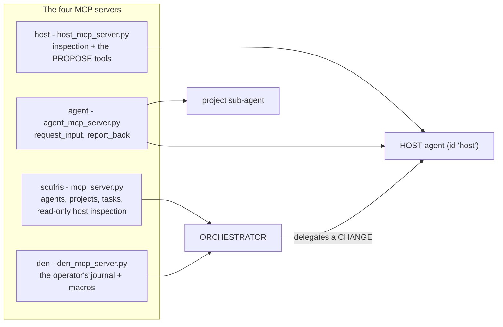

# `scufris/` - the architecture

How the application is put together: what runs in which process, who is trusted
with what, and where a request travels. Setup lives in the
[root README](../README.md); the rules for changing this code live in
[`AGENTS.md`](../AGENTS.md); the reasoning behind each fork lives in the
`DECISION.md` files under [`tasks/`](../tasks/). This file is the layer between
them.

## 1. One process, three privilege levels

The app is a single FastAPI/Uvicorn process that runs as the operator. It spawns
agent CLI subprocesses (which run arbitrary shell as that same user), and it
talks to a **separate root process** over a unix socket. Nothing else is
privileged.


The boundaries that matter, and what enforces each:

| Boundary | Enforced by | Why it is there |
|---|---|---|
| Browser -> app | one deny-by-default HTTP middleware in `app.py` plus a tiny public allowlist (`auth.PUBLIC_PATHS`, `PUBLIC_STATIC_PATHS`) | a new route is protected because it was added, not because someone remembered a decorator. `tests/test_auth.py` enumerates `app.routes` to prove it |
| Telegram -> operator identity | the chat-id allowlist, re-checked in `app._build_telegram_approval_ops` | the bot is in-process and polls outward, so there is no inbound port and no webhook. The allowlist IS the credential, and the transport never supplies an actor string of its own |
| agent subprocess -> app | a per-process bearer token minted in `create_app` (`Settings.auth_api_token`) | the app calls its own API from MCP tool subprocesses. Loopback is not an identity |
| agent subprocess -> decisions | `auth.OPERATOR_ONLY_PATTERN` | a machine token may never approve, deny, revert, cancel, or run the checks on demand. Approving is an operator act and needs a session, whatever the bind address |
| app -> root | unix socket plus `SCUFRIS_HOSTD_SECRET`, authenticated per frame | no sudo rules exist. The app cannot run a privileged command, only ask for a verb |
| agent CLI -> root socket | `config.SECRET_ENV_VARS`, stripped in `agent.agent_subprocess_env` | the secret arrives via an `EnvironmentFile`, so it IS in `os.environ`. Without stripping, every shell command the model runs would hold the credential for the root socket |
| root -> the record | `hostd/audit.py`: only an append path exists | the audit has to stay trustworthy when the app is the thing that misbehaved |

Two secrets belong in the sops dotenv the unit reads as an `EnvironmentFile`:
`SCUFRIS_AUTH_PASSWORD_HASH` and `SCUFRIS_HOSTD_SECRET`. `create_app` refuses to
build an app that has the hostd secret and no password hash - host agency with
nobody to approve is not a deployment.

## 2. Reading the host

`host/` is read-only and needs no privilege. Every command goes through one
`Runner` seam, every report carries an `Availability`, and every read is bounded.
That is the whole package's contract, and it is what makes "I could not read
this" a different answer from "there is nothing here". Details in
[`host/README.md`](host/README.md).

Two consumers: the dashboard (`/api/host/overview`, cached because it shells out)
and the inspection MCP tools, which BOTH the orchestrator and the host agent
hold.

## 3. Changing the host: one contract

Every mutating path obeys this, with no exceptions:

```
propose -> preview -> approve -> apply -> audit -> roll back
```

```
   HOST AGENT                APP                     HOSTD (root)          OPERATOR
   ==========                ===                     ============          ========

  propose_host_action  -->  POST /api/host/actions
   (a VERB + typed args)      |
                             |  requester from the CREDENTIAL,
                             |  never from the request body
                             +--------------------------->  build_plan(verb, args)
                                                            ActionRefused if not
                                                            a verb it implements
                                                              |
                                                            build_preview()
                                                            + Reversal + Fingerprint
                                                              |
                             <-------- ProposalView (id) -----+  state: PENDING
                             |                                   (10 minute window)
   agent goes BLOCKED  <-----+
   (operator-bound: the      |
    orchestrator may not     +-- render_action() --> dashboard /host/  ---> reads
    answer it)               |          ONE renderer  Telegram message  ---> decides
                             |                                                 |
                             |  <----- approve(id, actor) / deny(id, reason) --+
                             |         actor derived from the surface's
                             |         own credential
                             +--------------------------->  apply(id)
                                                            refuses: not_found,
                                                            already_used, expired,
                                                            drifted
                                                              |
                                                            Executor: step 1..n
                                                            in its own process group
                                                              |
                                                            append AuditRecord
                             <------ ResultFrame -------------+  state: APPLIED
                             |       steps_completed/total       or FAILED
   agent RESUMED <-----------+
   with the applied result
   or the denial reason      +--> revert: the applied record offers exactly
                                  the recorded reversal, as a NEW proposal
                                  with its own preview and approval
```

Properties this shape gives, rather than checks that try to:

- **A caller names a verb, never a command.** No request has an argv field, and
  `ActionKind` is a closed enum, so an unknown verb fails to parse at the socket.
  The helper builds every argv itself.
- **Preview one thing, apply another has no code path.** The proposal registry
  lives in the privileged process; a caller can only name an id the helper
  issued, and the approved argv is the only argv there is.
- **A proposal is used once.** Every state but `PENDING` is terminal, and
  `APPLYING` is the atomic claim, so two approvals racing on one id produce one
  execution and one refusal.
- **Drift is terminal, not a warning.** A preview describing a system that has
  moved is `DRIFTED`: re-propose and read a fresh preview.
- **A half-applied plan says so.** `steps_completed < steps_total` is a real
  recorded state, which for a configuration change means this boot and the next
  boot disagree.

Two surfaces decide, and there is exactly one set of rules:
`host_approvals.HostApprovalService` owns approve / deny / cancel / revert and
the `decidable()` predicate, both surfaces render from
`host_actions.render_action`, and the actor string is derived from the
credential - a session id for the dashboard, `operator:telegram:<chat_id>` for
the chat. The difference between the two surfaces is that one string.

An action that cannot be undone has no ordinary approve control at all:
`host_actions.confirmation_for` demands a typed acknowledgement, and the server
enforces the same rule the UI shows.

The verbs, their arguments, the refusals and the wire format are in
[`hostd/README.md`](hostd/README.md).

## 4. Agents

A run is never done inside a request. `supervisor.py` executes it in the
background, `eventbus.py` fans its events out to SSE subscribers with a bounded
replay buffer, and the HTTP layer only starts runs and reads streams. That is
what makes a turn survivable: a browser can reconnect mid-run, and the Telegram
bot watches the same events.

- **The orchestrator** is the landing chat. It delegates rather than doing
  everything itself: `run_agent(id, goal)` for a project, `run_agent("host",
  goal)` for a machine change.
- **Project agents** are records in `agent_store/`, bound to a project from
  `projects.py`, each with its own backend, model, permission mode and resumable
  session.
- **The host agent** (`enums.HOST_AGENT_ID`) is reserved, bound to the MACHINE
  rather than a project, read-only on files by construction, and the only
  audience holding the propose tools.

Agents talk **both ways**. A sub-agent that hits a decision it cannot make
safely calls `request_input` and finishes `waiting`; the orchestrator either
polls (`pending_agents`) or is woken by `wake.py` when `SCUFRIS_AUTO_WAKE` is on,
then answers by resuming that session. `report_back` closes the loop the other
way.

A host approval travels the same road with one deliberate difference:

- **`waiting` means the orchestrator owes an answer. `blocked` means the
  OPERATOR does.** A blocked agent shows up in `pending_agents`, and the chat
  route refuses an agent-credential message to it - "approved, go ahead" is not
  the orchestrator's to say.
- Liveness is asked as `live_for_agent` (undecided, still PENDING with the
  helper, inside its window), not as "is the agent blocked": keying it on the
  state alone left an agent permanently unreachable when nobody ever answered.

Any in-flight turn can be cancelled, from the chat's stop button or the
orchestrator's `cancel_agent` tool; the partial answer is kept and tagged.

## 5. Which agent holds which tools

The audience split is PHYSICAL. A tool reaches an audience by being registered on
a server that audience's turn wires up - not by a filter at call time.
`enums.audience_for` decides; `agent.scufris_mcp_servers` wires it.



`mcp_host_tools.register(mcp, actions=...)` defines the host toolset once:
`mcp_server.py` registers it with `actions=False`, `host_mcp_server.py` with
`actions=True`. So the orchestrator can answer "why is this box hot" directly,
while changing anything is a delegation - and a project sub-agent has no host
server at all.

There is deliberately **no approve tool**, for any audience.
`tests/test_host_mcp_server.py::test_the_agent_has_no_tool_that_approves_a_host_action`
asserts its absence by walking the registered tool names. The
propose/preview/approve contract is stated in exactly one steering preamble,
`sessions.HOST_STEERING_PREAMBLE`.

`SCUFRIS_DISABLED_TOOLS` drops tools inside the MCP server process at startup, so
a disabled tool genuinely cannot be called.

## 6. Authentication

`auth.py` plus one middleware in `app.py`:

- The **bind address decides the posture** (`SCUFRIS_AUTH_MODE=auto`): open on
  loopback so `pytest`, the examples and the mock backend need no credentials;
  mandatory on anything network-reachable, where the server refuses to START
  without a password hash rather than warning and serving.
- Sessions are opaque ids in `HttpOnly`, `SameSite=Lax` cookies backed by
  revocable server-side records under `SCUFRIS_STATE_DIR`. State-changing
  requests also need a CSRF token and a same-origin `Origin`/`Referer`.
- The **machine token** is minted per process and kept out of `os.environ`
  entirely, so it reaches only the MCP servers that call the API - an env var
  would be inherited by every shell command the model runs.
- `OPERATOR_ONLY_PATTERN` refuses that token on the decision endpoints and on
  `/api/host/digests/run`, whatever the bind address.
- The posture itself is not runtime-mutable: it must not be changeable through
  the surface it protects.

## 7. The HTTP surface

| Group | What it serves |
|---|---|
| `/`, `/stats/`, `/host/`, `/agents/`, `/projects/`, `/settings/`, `/login/` | the static dashboard pages from `SCUFRIS_WEB_DIST` |
| `/api/stats`, `/api/processes` | live metrics (`metrics.py`, `processes.py`) |
| `/api/host/overview` | the cheap host snapshot, server-side cached |
| `/api/host/actions...` | propose, list, inspect, stream, approve, deny, cancel, revert - the contract in section 3 |
| `/api/host/config/changes...` | the R3 build-then-propose flow (`hostconfig.py`) |
| `/api/host/audit`, `/api/host/digests`, `/api/host/digests/run` | the root helper's own log, the digest history, an on-demand pass |
| `/api/chat`, `/api/chat/stream`, `/api/chat/reset` | the landing orchestrator |
| `/api/agents...` | agent CRUD, runs, events (SSE), transcript, status, cancel, fork, `request_input`, `report_back`, `pending` |
| `/api/agent/...` | the orchestrator's own config, health, sessions, tools, usage |
| `/api/projects...` | project records and discovery (`projects.py`, `sesh.py`) |
| `/api/config`, `/api/agent/config` | the settings surface (`settings_store.py`) |
| `/api/auth/login`, `/logout`, `/session` | the session endpoints |

Public without a session: the login endpoints, the login page and its assets, and
the health probe. Everything else is denied by default.

## 8. Module map

| Module | Role |
|---|---|
| `app.py` | the FastAPI application: routes, the auth middleware, wiring every service together in `create_app` |
| `cli.py`, `__main__.py` | the `scufris` entry point (`serve`, `chat`, `login`, `hash-password`, `mcp-server`) |
| `config.py` | the settings model (env prefix `SCUFRIS_`), `SECRET_ENV_VARS`, backend/model catalogs |
| `settings_store.py` | runtime-mutable settings layered over the env-seeded base, persisted under the state dir |
| `enums.py` | the shared option enums, `HOST_AGENT_ID`, and `audience_for` |
| `auth.py` | sessions, CSRF, the public allowlist, `OPERATOR_ONLY_PATTERN`, password hashing |
| `metrics.py`, `processes.py` | live CPU/memory/disk/network stats and per-application process aggregation |
| `host/` | read-only host inspection ([README](host/README.md)) |
| `hostd/` | the root helper ([README](hostd/README.md)) |
| `hostclient.py` | the app's side of the socket: connect, one authenticated request, read frames. An apply is a stream that can be cut |
| `host_actions.py` | the app-side record, the in-memory queue, `confirmation_for`, and `render_action` - the one renderer both surfaces use |
| `host_approvals.py` | the decision seam: approve / deny / cancel / revert / `decidable()`. `apply` is called from exactly one place |
| `hostconfig.py` | the unprivileged half of R3: resolve a ref to a rev, build the toplevel as the operator |
| `scheduler.py`, `checks.py`, `digest.py` | the clock, the judgement, the words |
| `agent/`, `backends/` | the backend seam (codex app-server, claude, opencode, mock) and the subprocess environment. `agent/`: stream events, subprocess env, MCP wiring, the codex app-server turn. `backends/`: the `AgentBackend` protocol and one module per adapter |
| `opencode_client.py` | HTTP client for a local `opencode serve` daemon |
| `supervisor.py`, `eventbus.py`, `wake.py` | background runs, event fan-out to SSE, and the orchestrator wake bridge |
| `agent_store/`, `projects.py`, `sesh.py`, `project_capabilities.py` | agent and project records, directory discovery, per-project skills and tools. `agent_store/`: the record, the session registry, the durable run outcomes, and the store itself |
| `sessions/`, `reasoning_store.py` | session introspection, steering preambles, and the reasoning sidecar. `sessions/`: the models, the codex rollout reader, the transcript fold, and usage |
| `mcp_server.py`, `den_mcp_server.py`, `host_mcp_server.py`, `agent_mcp_server.py` | the four MCP servers, one per audience |
| `mcp_host_tools.py`, `mcp_common.py`, `mcp_models.py`, `mcp_health.py` | the host toolset defined once, plus shared MCP plumbing |
| `telegram.py` | the second operator surface: long poll, the allowlist, `/approvals`, `/deny`, inline keyboards, the digest |
| `health.py`, `logsetup.py`, `version.py` | diagnostics, logging configuration, and the one place the app learns its own version |

## 9. State on disk

Under `SCUFRIS_STATE_DIR` (default `~/.local/state/scufris`): the persisted
settings overrides, the session records, the agent and project records, the
reasoning sidecar, and the digest history. All of it is the app's own, all of it
disposable except the records you care about keeping.

Two things are deliberately NOT here:

- **The proposal queue.** `HostActionStore` is in-memory, because the helper is
  the single source of truth for what has been proposed. After a restart the app
  rebuilds its queue from the read-only `list_pending` verb, applying ADDITIONS
  only: an absence cannot be told apart from expired, denied elsewhere, or just
  applied.
- **The audit log.** It is root-owned, written by the helper, at
  `/var/log/scufris-hostd/audit.jsonl`.

## 10. How it is proven

| Proof | What it covers |
|---|---|
| `nix flake check` | ruff, mypy, pytest and `tatr check`, each against a fresh copy of the tree |
| `cd web && npm run ci` | prettier, eslint, vitest, webpack build |
| `nix build .#scufris .#scufris-web` | what a release ships (flake check only evaluates these) |
| `nix build .#scufris-vm-test` | the app as a real NixOS unit |
| `nix build .#scufris-hostd-vm-test` | a real root unit on a real socket, with a real activation and rollback. Needs KVM, so it guards the release pipeline rather than CI |
| `examples/host_inspect.py` | the inspection package end to end |
| `examples/host_action.py` | the propose/preview/approve framework, including a no-undo action and one stopped mid-apply |
| `examples/host_agent.py` | the host agent's round trip, and the orchestrator being refused |
| `examples/nixos_change.py` | build, diff, activate, roll back |
| `examples/telegram_approval.py` | every message and button, one-tap and two-tap |
| `examples/host_digest.py` | the digest in all five states |
| `examples/auth_session.py` | the login and session boundary |
| `examples/comms_loop.py` | the agent/orchestrator comms loop against the mock backend |

Tests inject a `Runner` (canned command output), an `Executor` (a scripted apply)
and a `Files` (the store questions R3 asks), so the whole path including
cancellation runs without root.

## 11. What this design does NOT claim

A security story that overclaims is worse than none:

- **These controls are not a defence against a compromised operator account.**
  On this machine the operator is in the `docker` group, which is
  root-equivalent. What they defend against is the model acting unasked, a
  prompt-injected agent, an approval given without visible consequences, and the
  absence of a record.
- **The hostd secret raises a bar, it is not a boundary.** It keeps the agent CLI
  subprocesses off the socket. It does not stop that user becoming root by other
  means.
- **An activated NixOS configuration can run anything as root.** The controls are
  the reviewed commit, the closure diff the operator reads, and the audit record
  naming the revision.
- **The helper records the operator identity the app reports** and does not claim
  to have verified it. What it verifies is that the action being applied is
  exactly the one it previewed.
- **The dashboard is plain HTTP** and assumes a trusted LAN.
