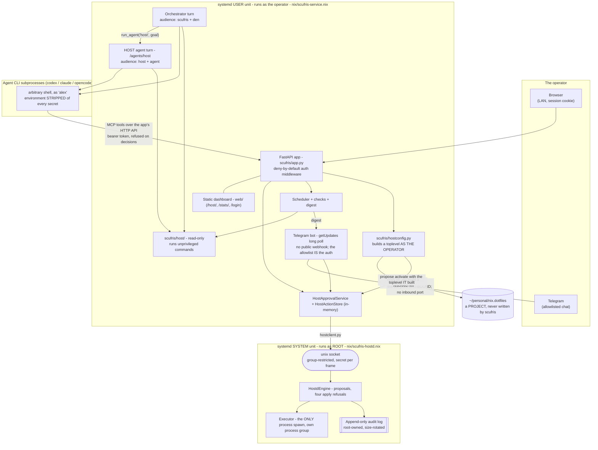
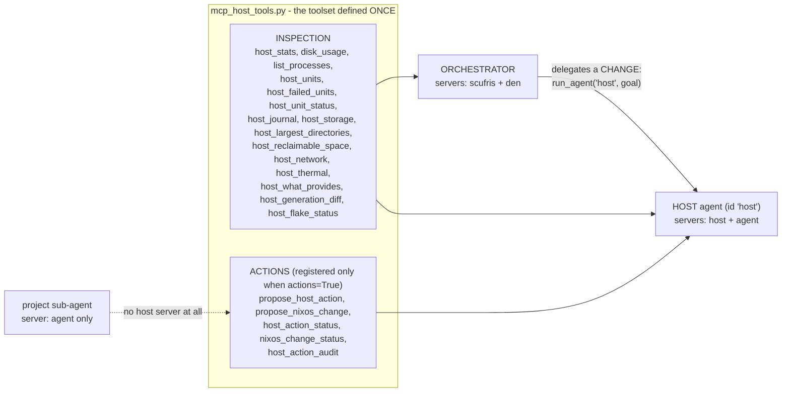
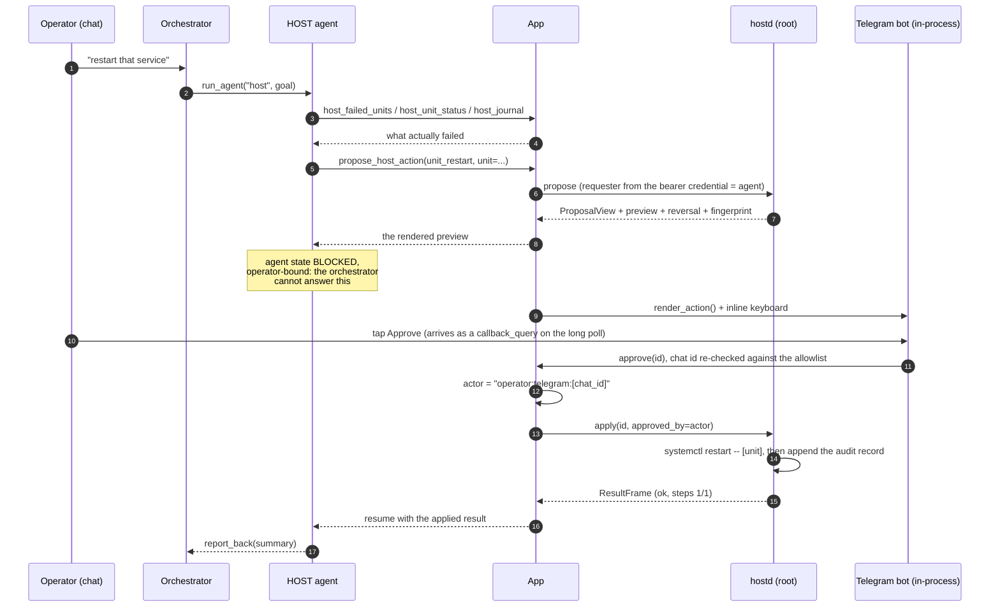
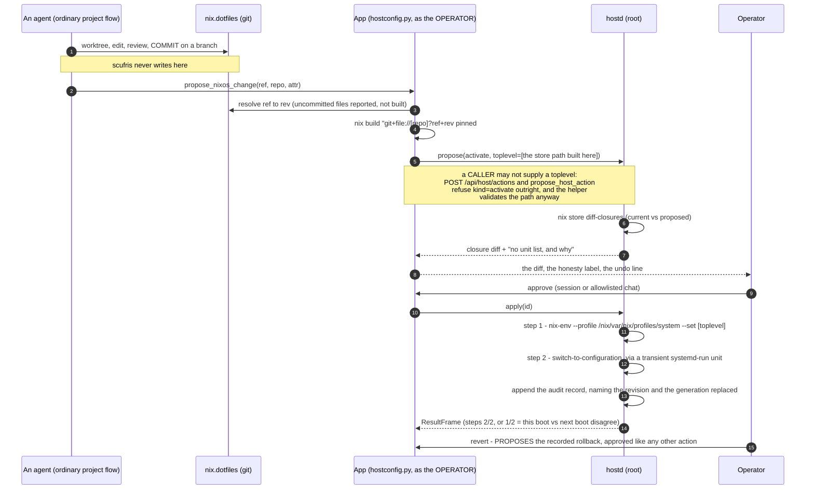

# Architecture: Scufris as a NixOS host operator

What this epic built, as a map. It describes the system that exists on master at
the epic's close (2026-07-30) and points at the code and the decision records
rather than re-arguing them.

- The rules an agent must follow are in the repo's `AGENTS.md`.
- The reasoning behind each fork is in the `DECISION.md` files listed in
  `TASK.md` under Decisions.
- This file is the orientation layer between the two: how the pieces fit, who is
  allowed to do what, and where a request travels.

## 1. What changed

Before the epic, the host surface was three read-only MCP tools (`host_stats`,
`disk_usage`, `list_processes`) and every sub-agent was bound to a project
working tree. Scufris could describe the box and change nothing about it.

After the epic there is:

- a read-only inspection package (`scufris/host/`) covering units, logs,
  storage, network, thermals, packages and generations;
- a privileged helper (`scufris/hostd/`) that runs as root, owns a closed set of
  typed verbs, and holds every proposal and the audit log;
- one decision seam (`scufris/host_approvals.py`) with two operator surfaces
  (the dashboard and Telegram) and no second set of rules;
- a reserved HOST agent (`enums.HOST_AGENT_ID`) that is the only audience
  holding the mutating tools;
- an authenticated dashboard, because none of the above may exist on an
  unauthenticated LAN bind;
- and one proactive path: scheduled checks that reach the operator in Telegram.

Every mutating path obeys one contract, with no exceptions:

```
propose -> preview -> approve -> apply -> audit -> roll back
```

## 2. Processes and trust boundaries

Three privilege levels, two of them separate OS processes with separate units.



The boundaries that matter, and why each is where it is:

| Boundary | Enforced by | Why |
|---|---|---|
| Browser -> app | one deny-by-default HTTP middleware (`app.py`) plus a tiny public allowlist (`auth.PUBLIC_PATHS`, `PUBLIC_STATIC_PATHS`) | a new route is protected because it was added, not because someone remembered a decorator; `tests/test_auth.py` enumerates `app.routes` to prove it |
| Telegram -> operator identity | the chat-id allowlist, re-checked in `app._build_telegram_approval_ops` | the bot is in-process and long-polls outward, so it opens no inbound port; the allowlist IS the credential, and the transport never supplies an actor string of its own |
| agent subprocess -> app | per-process bearer token `SCUFRIS_API_TOKEN`, minted in `create_app` | the app calls its own API from MCP tool subprocesses; loopback is not treated as an identity |
| agent subprocess -> decisions | `auth.OPERATOR_ONLY_PATTERN` | a machine token may never approve, deny, revert, cancel, or run the checks on demand; approving is an operator act and needs a session, whatever the bind address |
| app -> root | unix socket + `SCUFRIS_HOSTD_SECRET`, authenticated per frame | no sudo rules exist; the app cannot run a privileged command, only ask for a verb |
| agent CLI -> root socket | `config.SECRET_ENV_VARS`, stripped in `agent.agent_subprocess_env` | the secret arrives via an `EnvironmentFile`, so it IS in `os.environ`; without stripping, every shell command the model runs holds the credential for the root socket |
| root -> the record | `hostd/audit.py`: only an `append` path exists | the audit has to be trustworthy when the app is the thing that misbehaved |

Two secrets, both in `sops secrets/scufris.env` in the config repo:
`SCUFRIS_AUTH_PASSWORD_HASH` (the operator's password, hashed by
`scufris hash-password`) and `SCUFRIS_HOSTD_SECRET` (also in a file the helper
reads via `secretFile`). `create_app` refuses to build an app that has a hostd
secret and no password hash: host agency with nobody to approve is not a
deployment.

## 3. The one contract

```
   HOST AGENT                APP                     HOSTD (root)          OPERATOR
   ==========                ===                     ============          ========

  propose_host_action  -->  POST /api/host/actions
   (a VERB + typed args)      |
                             |  requester from the CREDENTIAL,
                             |  never from the request body
                             +--------------------------->  build_plan(verb, args)
                                                            ActionRefused if not
                                                            a verb it implements
                                                              |
                                                            build_preview()
                                                            + Reversal + Fingerprint
                                                              |
                             <-------- ProposalView (id) -----+  state: PENDING
                             |                                   (10 minute window)
   agent goes BLOCKED  <-----+
   (operator-bound: the      |
    orchestrator may not     +-- render_action() --> dashboard /host/  ---> reads
    answer it)               |          ONE renderer  Telegram message  ---> decides
                             |                                                 |
                             |  <----- approve(id, actor) / deny(id, reason) --+
                             |         actor derived from the surface's
                             |         own credential
                             +--------------------------->  apply(id)
                                                            refuses: not_found,
                                                            already_used, expired,
                                                            drifted
                                                              |
                                                            Executor: step 1..n
                                                            in its own process group
                                                              |
                                                            append AuditRecord
                             <------ ResultFrame -------------+  state: APPLIED
                             |       steps_completed/total       or FAILED
   agent RESUMED <-----------+
   with the applied result
   or the denial reason      +--> revert: the applied record offers exactly
                                  the recorded reversal, as a NEW proposal
                                  with its own preview and approval
```

Properties this shape gives, rather than checks that try to:

- **A caller names a verb, never a command.** There is no argv field on any
  request (`hostd/protocol.py`), and `ActionKind` is a closed enum, so an unknown
  verb fails to parse at the socket and never reaches the code that builds
  commands. The helper builds every argv.
- **Preview one thing, apply another has no code path.** The proposal registry
  lives in the privileged process. A caller can only name an id the helper itself
  issued, and the argv the operator approved is the only argv there is.
- **A proposal is used once.** Every `ProposalState` except `PENDING` is
  terminal; `APPLYING` is the atomic claim, so two approvals racing on one id
  produce one execution and one refusal.
- **Drift is terminal, not a warning.** A preview describing a system that has
  since moved is `DRIFTED`, so the operator re-proposes and reads a fresh preview
  instead of approving an old description of a new world.
- **A plan is a SEQUENCE, and a half-applied one says so.** `Plan.steps` is a
  list; `steps_completed < steps_total` is a real state that the record names
  (for R3: this boot runs the old configuration, the next boot runs the new one).
- **Cancellation kills the process group.** `nixos-rebuild` and
  `nix-collect-garbage` spawn children; killing only the parent would leave
  root-owned work running with nothing watching it.

## 4. The risk taxonomy IS the verb set

`RiskClass` and `ActionKind` in `hostd/actions.py`. R4 is enforced by no verb
existing, not by a deny check.

| Class | Verbs | Reversal | Confirmation |
|---|---|---|---|
| R1 service control | `unit_start`, `unit_stop`, `unit_restart`, `unit_reload` | recorded unit state; often "no undo" and that is NORMAL | ordinary |
| R2 disposable cleanup | `gc_older_than`, `gc_store` | none, ONE-WAY | strong: type the verb name |
| R3 configuration change | `activate`, `rollback` | back to a recorded generation NUMBER | ordinary (strong if the previous generation could not be recorded) |
| R4 refused entirely | none - partitioning, users, key material, the firewall, scufris itself | n/a | n/a |

Two rules inside R1 that a name-based deny-list would have got wrong:

- **Refuse the TYPE, not the name.** R1 acts on services, sockets, timers, paths
  and mounts only. Targets, slices and scopes have no code path, because
  `emergency.target` kills sshd without naming sshd and `user@1000.service` ends
  the session the scufris user unit lives in.
- **The strong confirmation is for what DESTROYS something**
  (`host_actions.confirmation_for`): irreversible AND not mere service control.
  Keying it on `reversal.possible` alone was tried and refuted by measurement -
  it demanded a typed acknowledgement for every service restart, and a warning
  that fires on the routine act is why nobody reads the one on `gc_store`.

There is no shell verb, at any privilege, under any approval. Adding a
capability is a reviewed code change with a test, never a configuration line.

## 5. Who holds which tools

The MCP audience split is PHYSICAL: a tool reaches an audience by being
registered on a server that audience's turn wires up, not by a filter at call
time. `enums.audience_for` decides; `agent.scufris_mcp_servers` wires it.



`mcp_host_tools.register(mcp, actions=...)` is the whole mechanism:
`mcp_server.py` calls it with `actions=False`, `host_mcp_server.py` with
`actions=True`. Only the two `propose_*` tools in that set can start a change;
the status and audit tools ride with them because they are how a proposing agent
follows its own proposal. So "why is this box hot" is a direct answer from the
orchestrator, while changing anything is a delegation. The propose/preview/approve contract is
therefore stated in exactly ONE steering preamble
(`sessions.HOST_STEERING_PREAMBLE`), and there is deliberately no approve MCP
tool - `tests/test_host_mcp_server.py`'s
`test_the_agent_has_no_tool_that_approves_a_host_action` asserts its absence by
walking the registered tool names.

## 6. An R1 restart, end to end



The same flow from the dashboard differs in exactly one thing: the actor string
comes from a session instead of a chat id. Everything after that - already
decided, expired, drifted, the one-way acknowledgement, the race - has one
implementation in `host_approvals.py`, and both surfaces render from one
renderer (`host_actions.render_action`) and offer a control only where
`HostApprovalService.decidable()` says a decision can still be made.

Three supporting facts about the queue:

- **A pending approval is a BLOCKED agent**, not a WAITING one. WAITING means
  the orchestrator owes it an answer; BLOCKED means the OPERATOR does. The chat
  route refuses an agent-credential message to a blocked agent, because
  "approved, go ahead" is not the orchestrator's to say.
- **The helper holds every proposal; the app rebuilds its queue from it.**
  `HostActionStore` is in-memory by design, and the read-only `list_pending`
  verb is how a restart inside a proposal's window recovers. Only ADDITIONS are
  applied: an absence cannot be told apart from expired, denied elsewhere, or
  just applied.
- **An expiry resumes nobody.** A refusal keyed on the agent's BLOCKED state
  alone left a host agent permanently unreachable when the operator never
  answered, so liveness is asked as `live_for_agent` - undecided, still PENDING
  with the helper, and inside its window.

## 7. R3: changing the NixOS configuration

The rule that shapes the whole feature: **the configuration repository is a
PROJECT, and Scufris does not edit it.** An agent changes
`~/personal/nix.dotfiles` the way it changes any project - a sprout worktree, a
commit, a review. There is no configuration editor here, no typed "add a
package" verb, and no code path that writes to that repository
(`tasks/20260729-125035/DECISION.md`).



Five things this flow does deliberately:

- **Build as the operator, never as root.** Nix evaluation reads files with the
  evaluating user's privileges, so a configuration evaluated as root could read a
  host key or a sops age key into a derivation output.
- **Build from `?rev=`.** The flake URL is
  `git+file://<repo>?ref=<ref>&rev=<rev>` plus
  `#nixosConfigurations.<attr>...toplevel`, and a bare object id (the tip of
  nothing) gets `?allRefs=1&rev=` instead so nix can find it - `hostconfig.flake_url`
  and `build_argv`. The tree comes from the commit, so uncommitted files
  are structurally excluded (and reported), and the flow cannot dirty the repo.
- **The preview does not run the proposed configuration.** The unit-restart list
  could only come from that configuration's own `switch-to-configuration`, as
  root, before anyone approved it. So it is not shown, and the preview says why.
  `nix store diff-closures` prints NOTHING for identical closures on exit 0, so
  "no closure change" is stated explicitly.
- **A switch already running blocks the next one.** The apply-time preflight
  refuses when `nixos-rebuild-switch-to-configuration.service` is active - the
  same transient unit name `nixos-rebuild` uses - and refuses when it cannot
  tell.
- **Rollback names a NUMBER.** The helper resolves that generation's store path
  from the profile. `nixos-rebuild --rollback` ("whatever is previous") is
  deliberately not used.

The residual risk, stated rather than engineered away: an activated
configuration can run anything as root. The controls are the reviewed commit,
the diff the operator reads, and the audit record naming the revision.

## 8. The one proactive surface

Everything else in Scufris starts from a person. This does not.

```
   scheduler.py                 checks.py                digest.py        app.py
   ------------                 ---------                ---------        ------
   two fixed schedules
   'watch'  every N seconds --> run_checks()  ---------> render()  -----> Telegram
   'daily'  at HH:MM            each check:              boring case      (allowlisted
                                - threshold from         is ONE line       chats)
   state PERSISTS:                SETTINGS               leads with     -> /host/ page
    next_due, last_run,         - UNAVAILABLE is         what needs        (DigestStore
    last_result                   not OK                 attention         keeps the
                                - a raise/timeout                          last 30)
   nothing fires on a            becomes a NAMED
   fresh schedule                failure
   a missed window is
   RECORDED, not replayed       escalation: checks.ESCALATABLE
   no overlapping run           (R2 cleanup verbs ONLY, default OFF)
                                     |
                                     +--> an ordinary proposal through
                                          HostApprovalService - no side door
```

- `watch` delivers only on a warn/crit or a recovery. `daily` always delivers,
  even if it is one line - that line is the heartbeat, which is what makes
  silence from `watch` unambiguous.
- Measured failure modes that shaped it: a standing condition re-sent every 15
  minutes was 96 messages a day for a disk that had not moved, and with
  escalation on it re-proposed a root action alongside each one. So `watch`
  renders only when a check ENTERS or worsens into an attention state, or
  recovers.
- Nothing fires on a fresh schedule, because that made every app start -
  including every test that boots one - perform real subprocess reads. Reading
  the host for a check pass is injectable (`create_app(host_inspector=...)`) for
  the same reason.

## 9. Where the code lives

| Path | Role |
|---|---|
| `scufris/host/` | read-only inspection. One door to the outside (`run.py`'s `Runner`), `Availability` on every model, everything bounded. `HostInspector` is the facade. |
| `scufris/hostd/` | the root helper: `protocol.py` (the wire contract), `actions.py` (verbs, risk, argv, plans), `preview.py` + `nixos.py` (previews, reversal, fingerprint), `engine.py` (proposals and the four apply refusals), `executor.py` (the only process spawn), `audit.py` (append-only), `server.py` (the socket), `main.py` (the unit entry point) |
| `scufris/hostclient.py` | the app's side of the socket: connect, one authenticated request, read frames. Apply is a stream that can be cut. |
| `scufris/host_actions.py` | the app-side record, the in-memory queue, `confirmation_for`, and `render_action` - the ONE renderer both surfaces use |
| `scufris/host_approvals.py` | the decision seam: approve / deny / cancel / revert / `decidable()`. `apply` is called from exactly one place. |
| `scufris/hostconfig.py` | the unprivileged R3 half: resolve a ref to a rev, build the toplevel as the operator |
| `scufris/mcp_host_tools.py` | the host toolset, defined once, registered per audience |
| `scufris/host_mcp_server.py` | the HOST-agent-only MCP server (`host`) |
| `scufris/auth.py`, middleware in `scufris/app.py` | sessions, CSRF, the public allowlist, `OPERATOR_ONLY_PATTERN` |
| `scufris/scheduler.py`, `checks.py`, `digest.py` | the clock, the judgement, the words |
| `scufris/telegram.py` | the second operator surface: allowlist as credential, `/approvals`, `/deny`, inline keyboards, the digest |
| `web/src/host.ts`, `host-view.ts`, `host.html` | the dashboard queue and audit page |
| `nix/scufris-service.nix` | the app's module: a NixOS system unit (`DynamicUser`) on NixOS, or a home-manager `systemd.user` unit. This host deploys the USER unit, so the app runs as the operator - which is why the hostd secret has to be stripped from its children. |
| `nix/scufris-hostd.nix` | the helper as a root SYSTEM unit (`nixosModules.hostd`) - a separate module ON PURPOSE |

## 10. How it is proven

| Proof | What it covers |
|---|---|
| `nix flake check` | ruff, mypy, pytest, and `tatr check --ledger LESSONS.md`, each against a fresh copy of the tree |
| `cd web && npm run ci` | prettier, eslint, vitest, webpack build |
| `nix build .#scufris .#web` | what a release ships (flake check only EVALUATES these) |
| `nix build .#hostd-vm-test` | the half that cannot be faked: a real root unit on a real socket, and a REAL activation and rollback of a real second toplevel. Needs KVM, so it is not in CI - it guards the release pipeline. |
| `examples/host_inspect.py` | the inspection package end to end |
| `examples/host_action.py` | the propose/preview/approve framework |
| `examples/host_agent.py` | the host agent and the decision core |
| `examples/nixos_change.py` | the R3 build-diff-activate-rollback flow |
| `examples/telegram_approval.py` | every message and button, one-tap and two-tap |
| `examples/host_digest.py` | the digest in all five states (boring/watch, boring/daily, something wrong, something recovered, a check broken) |
| `examples/auth_session.py` | the login/session path |

Tests inject a `Runner` (canned command output), an `Executor` (a scripted
apply) and a `Files` (the store questions R3 asks), so the whole path including
cancellation runs without root.

## 11. What the design does NOT claim

Stated here because a security story that overclaims is worse than none:

- **These controls are not a defence against a compromised operator account.**
  `alex` is in the `docker` group, which is root-equivalent on this machine.
  What they defend against is the model acting unasked, a prompt-injected agent,
  an approval given without visible consequences, and the absence of a record.
  Tightening the account is a `nix.dotfiles` change and the operator's call.
- **The hostd secret raises a bar; it is not a boundary.** It keeps the agent CLI
  subprocesses (which run arbitrary shell as the same user) off the socket. It
  does not stop that user from becoming root by other means.
- **An activated configuration can run anything as root.** See section 7.
- **The helper records the operator identity the app reports and does not claim
  to have verified it.** What it verifies is that the action being applied is
  exactly the one it previewed.

## 12. Deploying it

Two operator actions gate any of this working, and neither is Scufris's to
perform:

1. `scufris hash-password`, then add the printed line plus
   `SCUFRIS_HOSTD_SECRET` to `sops secrets/scufris.env` in
   `~/personal/nix.dotfiles`.
2. `services.scufris-hostd.enable = true` (the `nixosModules.hostd` module),
   then bump the scufris flake input past the release carrying this work.

Until the secret exists, a LAN-bound scufris refuses to start - by design - and
every mutating host endpoint answers "not configured".
